# Project Overview

This is the detailed, narrative write-up of the range: how it was built, every technique that was
detonated, the exact CloudWatch Logs Insights queries used, the raw tool output, and the screenshots
taken along the way. `README.md` and `docs/results.md` are the concise summaries; this document is
the full record they point to.

The project ran in three phases:

1. **Stand up range infra inside existing sandbox** — confirm CloudTrail → CloudWatch ingestion.
2. **Detonate MVP five, prove SCPs** — MVP complete + 4 SCPs with `errorCode` proof.
3. **More detonation, responders, MTTR, publish** — 2–3 more techniques, a response layer, and a
   public repo with real measured numbers.

---

## Prior work: the landing zone this range runs on

**Prerequisite project:** Secure Multi-Account AWS Landing Zone (built July 2026)
**Repo:** github.com/muhunXD/aws-landing-zone
**Relationship to this project:** this range is deployed *inside* that landing zone and exists to
test it.

### What already exists

This project does not start from an empty AWS account. It is built inside a multi-account landing
zone I designed and deployed with Terraform in July 2026, and it exists specifically to answer the
question that build left open: **do the controls actually stop anything?**

### Organization and accounts

The landing zone is a single AWS Organization with the ALL feature set and the
`SERVICE_CONTROL_POLICY` policy type enabled, spanning four accounts across two organizational
units:

| Account | OU | Role in the landing zone | Role in this range |
|---|---|---|---|
| management_ac | Root | Organization owner, org trail, Terraform entry point | Unchanged — range Terraform authenticates here |
| log_archive_ac | Security | Hardened S3 bucket receiving all CloudTrail logs | Unchanged — forensic second copy |
| security_ac | Security | GuardDuty delegated administrator | Detection baseline for the comparison table |
| sandbox_ac | Workloads | Guardrail test account | **The range target account** |

Access is through IAM Identity Center with a single AdministratorAccess permission set and
eight-hour sessions. Terraform authenticates via the resulting mgmt SSO profile and reaches member
accounts by assuming `OrganizationAccountAccessRole` through provider aliases, so one
`terraform apply` can create resources across accounts.

### Preventive controls — six Service Control Policies

| # | SCP | Attached at | What it denies |
|---|---|---|---|
| 1 | `deny-leave-organization` | Org root | `organizations:LeaveOrganization` |
| 2 | `deny-cloudtrail-tampering` | Org root | `StopLogging`, `DeleteTrail`, `UpdateTrail`, `PutEventSelectors` |
| 3 | `deny-guardduty-tampering` | Org root | GuardDuty disable/delete actions |
| 4 | `deny-root-user` | Security + Workloads OUs | All actions by a root principal (management account keeps root for break-glass) |
| 5 | `deny-s3-public-access` | Workloads OU | Public-access-block changes and public bucket/object ACLs |
| 6 | `region-restriction` | Org root | Any regional action outside the allowed-region list, global services excepted |

The region restriction was deliberately canary-tested against the Workloads OU before being
promoted to the organization root, because a misconfigured region SCP can lock the operator out of
their own organization.

### Detective controls — centralized logging and GuardDuty

- **Organization CloudTrail** in the management account: `is_organization_trail = true`,
  multi-region, log-file validation enabled, global service events included, delivering
  management events to the log-archive bucket.
- **Log-archive S3 bucket**: versioned, SSE-encrypted, public-access-blocked, with a bucket policy
  scoped by `aws:SourceArn` to the trail itself and by organization ID to the write path.
- **GuardDuty**: administered from `security_ac` as a delegated administrator, with
  organization-wide auto-enable so findings from any account surface in one console.

### What that build proved — and what it did not

The landing zone proved that the controls **could be deployed**, correctly and reproducibly, as
code. Three explicit-deny proofs were captured from the sandbox account during that build: a
blocked CloudTrail stop-logging, a blocked cross-region call, and a blocked S3 public-access-block
change.

**It did not prove that the controls work under attack.**

| What was done | Why it falls short |
|---|---|
| Three hand-run CLI commands returning AccessDenied | Single commands are not adversary behaviour; nothing tested a chain, a sequence, or a technique with real tradecraft |
| GuardDuty validated with `create-sample-findings` | Sample findings are synthetic by design — they prove the pipeline is wired, not that GuardDuty detects anything |
| Three of six SCPs exercised | The other three were never tested at all |
| CloudTrail confirmed to be delivering logs | No detection logic was ever written against that data |

Put plainly: I had built a control plane and verified it was *switched on*. I had no evidence about
its **efficacy**.

### What this range inherits

| Landing zone asset | Reused in this range as | Effect on scope |
|---|---|---|
| `sandbox_ac` in the Workloads OU | The target account | Removes account creation from setup |
| The six SCPs | The preventive controls under test | Removes SCP authoring entirely; §7 starts pre-populated |
| GuardDuty, org-wide with delegated admin | The detection baseline my rules must beat | Removes detection-source setup |
| Organization CloudTrail → log-archive S3 | Untouched forensic copy alongside the new pipeline | No change required |
| `OrganizationAccountAccessRole` + provider-alias pattern | How range Terraform reaches into sandbox | Directly copied |
| mgmt SSO profile | Terraform and CLI authentication | Directly reused |
| Repo conventions — `.gitignore`, version pinning, account IDs via git-ignored tfvars, prefix and allowed_regions locals | Range repo scaffolding | Directly copied |
| The three denial-proof captures | Precedent for the `errorCode` evidence method used throughout §7 | Method already validated |

**Net effect:** roughly half of what the range specification treats as setup is already built.
That recovered time is what makes the Full-tier scope achievable inside the available calendar.

### Each SCP becomes a testable hypothesis

The most valuable thing the landing zone hands this project is not infrastructure — it is six
deployed policies that can each be converted into a falsifiable claim. Every row below is a
prediction this range either confirms or refutes with CloudTrail `errorCode` evidence. (This table
was written at planning time, before detonation — see the **Results** section at the end of this
document for the actual, measured outcomes.)

| SCP | ATT&CK technique that tests it | Predicted outcome | Actual | Evidence |
|---|---|---|---|---|
| `deny-cloudtrail-tampering` | T1562.008 — Impair Defenses: Stop/Delete Cloud Logs | Blocked | ⬜ | `errorCode: AccessDenied` on `StopLogging` |
| `deny-s3-public-access` | T1530 — Data from Cloud Storage (exposure step) | Blocked | ⬜ | ⬜ |
| `region-restriction` | T1580 — Cloud Infrastructure Discovery, out-of-region | Blocked | ⬜ | ⬜ |
| `deny-guardduty-tampering` | Defense-evasion: disable detection | Blocked | ⬜ | ⬜ |
| `deny-root-user` | Privilege abuse via root principal | Blocked | ⬜ | ⬜ |
| `deny-leave-organization` | Organization-escape attempt | Blocked | ⬜ | ⬜ |

### Design constraints inherited from the landing zone

The existing environment is not a neutral backdrop. Four of its properties actively shape how this
range must be built, and each is a deliberate design decision rather than a workaround.

**A second CloudTrail is required, and it is billable.** The organization trail delivers to S3
only. CloudWatch Logs Insights needs a trail delivering into a log group inside `sandbox_ac`.
Because the org trail already consumes the free first copy of management events for that account,
the range's local trail is a paid second copy. Volume is negligible at lab scale; log-group
retention is set to 7 days as an explicit cost control.

**`deny-s3-public-access` blocks the "exposed bucket" target design.** The generic version of this
range calls for a publicly readable S3 bucket. My SCP forbids it. The policy stays. The target
bucket is instead made reachable through an over-permissive bucket policy and IAM path, and the
blocked public-access attempt is recorded as prevented evidence. This is a real result, not a
compromise: **the control forced the attack to take a different, noisier route.**

**`region-restriction` constrains where detonation can happen.** All Stratus Red Team execution
must occur inside the allowed-region list. Any call outside it is denied at the organization
level, which makes out-of-region activity a source of evidence rather than a broken tool.

**State isolation is mandatory.** The range lives in a separate repository with separate Terraform
state. A `terraform destroy` in the range must never be able to reach landing zone infrastructure.
This separation is enforced by repo boundary, not by convention.

---

## Phase 1 — Stand up range infra inside existing sandbox

- Firstly, checking the `management_ac` SSO profile still works.
  Expected: an ARN containing `assumed-role/AWSReservedSSO_AdministratorAccess_.../admin`.
- Verify that the landing zone is still whole. Expected: Organization FeatureSet `ALL`, SCP policy
  type `ENABLED`; 4 accounts, all `ACTIVE`; 6 policies plus the AWS-managed `FullAWSAccess`;
  CloudTrail `lz-org-trail`, multi-region, organization trail; GuardDuty `security_ac` listed as
  delegated administrator.
- Checking `sandbox_ac` if it can actually host the range. Expected: an ARN containing
  `assumed-role/AWSReservedSSO_AdministratorAccess_.../admin`.
- Confirm GuardDuty is live in sandbox. **Expected:** one detector ID.
- Make sure `finding_publishing_frequency` is set to `FIFTEEN_MINUTES`. If not, change it in
  Terraform or the console.
- Create the sandbox budget. In the sandbox account console → Billing and Cost Management →
  Budgets → Create budget:

  | Setting | Value |
  |---|---|
  | Budget type | Cost budget |
  | Period | Monthly |
  | Amount | $50 |
  | Alert thresholds | 20% ($10), 50% ($25), 100% ($50) |
  | Email | your address |

  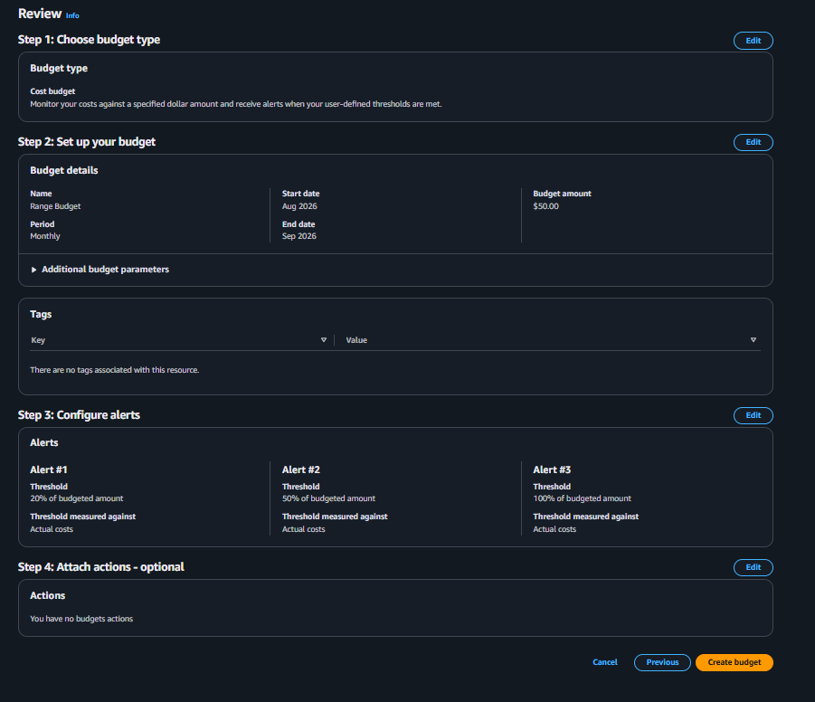
  *picture 1*

- Have these tools installed: **Terraform v1.15.8**, **AWS CLI v2.35.20**, **Git**, **Stratus Red
  Team** (from https://github.com/DataDog/stratus-red-team/releases, extracted and set in PATH —
  checking it gives a version number, then a table of AWS techniques with ATT&CK IDs), and
  **Prowler**, checked that it can authenticate against the sandbox account.
- Create the range repo and sandbox provider, so the directory has:

  | Folder | Contents |
  |---|---|
  | `terraform/` | Target environment, trail, metric filters, responders |
  | `attacks/` | Stratus runbooks, technique notes, detonation logs |
  | `detections/` | One `.md` per detection: query, logic, FP notes |
  | `evidence/` | Results table, denial proofs, Prowler output, screenshots |

- Create `.gitignore`, `terraform/versions.tf`, `terraform/variables.tf`.
- Create `terraform/terraform.tfvars` — enter your sandbox account.
- Create `terraform/terraform.tfvars.example`, `terraform/locals.tf`, `terraform/providers.tf`.
- Validate the connection: temporarily add a test block to `providers.tf` and run it.
  **Expected:** your sandbox account ID and an ARN containing
  `assumed-role/OrganizationAccountAccessRole/`. **Then delete the temporary block** and run
  `terraform apply` again to clear the output. (You must log in via SSO first before
  `terraform apply`.)

  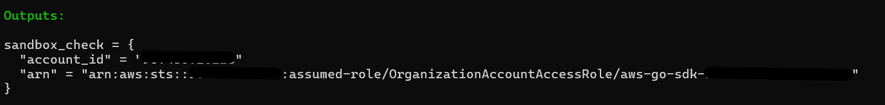
  *picture 2*

- Use git to save the version.
- Wire CloudTrail into CloudWatch Logs. But from the landing zone project, `deny-cloudtrail-tampering`
  denies `StopLogging`, `DeleteTrail`, `UpdateTrail`, and `PutEventSelectors` — org-wide, at the
  root. That means once this trail exists, you cannot modify it and you cannot delete it from the
  sandbox account. **If you do need to change it:** SCPs never apply to the organization's
  management account, so from `management_ac` you temporarily detach `deny-cloudtrail-tampering`
  from the root, fix the trail, and reattach it.
- Split into two Terraform stacks:
  - `logging/` — trail, log group, S3 bucket, IAM role
  - `target/` — vulnerable IAM roles, EC2, buckets

  Move `versions.tf`, `providers.tf`, `variables.tf`, `locals.tf`, and `terraform.tfvars` into
  **both** subdirectories.
- Create `terraform/logging/main.tf`. This creates the S3 bucket for CloudTrail, the CloudWatch
  log group, the IAM role for CloudTrail, and the CloudTrail config.
- Append to `terraform/logging/locals.tf`.
- `terraform apply`. Expected: ~7 resources added.
- Verify ingestion: open a new terminal, log in, wait around 15 minutes.
- Check the log group. In the **sandbox console** → **CloudWatch → Log groups →
  `/aws/cloudtrail/range`**.

  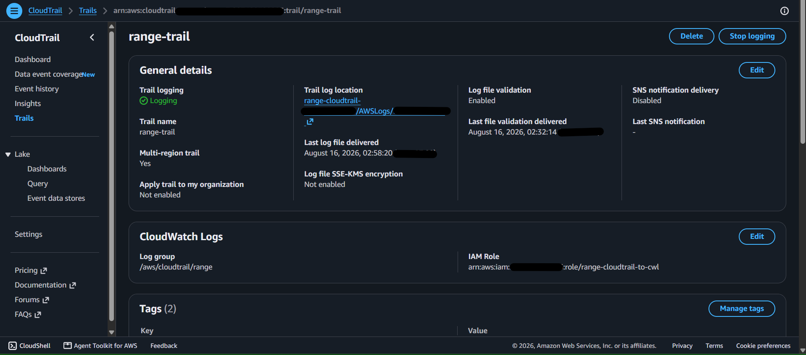
  *picture 3*

  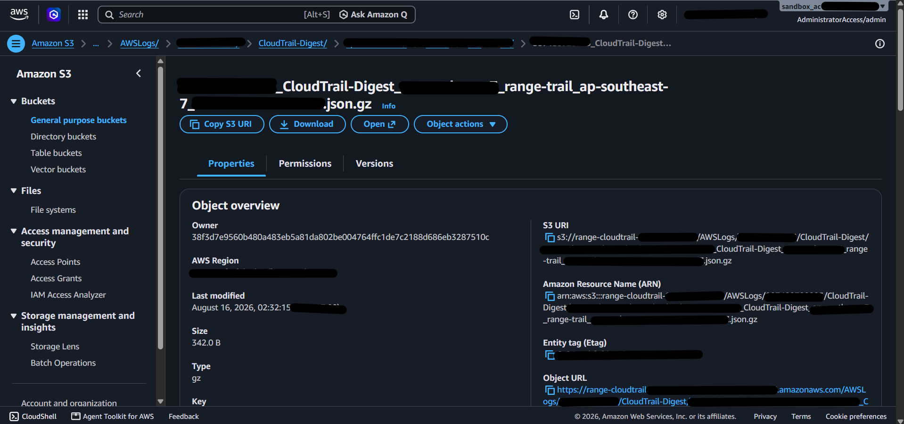
  *picture 4*

  With JSON output.

- Try querying it in CloudWatch Logs Insights.

  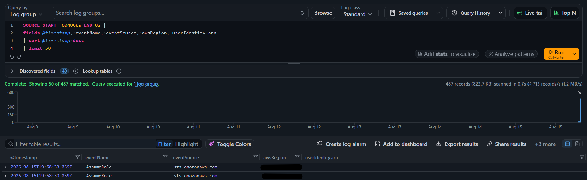
  *picture 5*

- Build/destroy the target environment: `target/` is a small, cheap, deliberately weak attack
  surface. The design principle: don't duplicate Stratus. Stratus Red Team **provisions its own
  prerequisites during warmup** — it creates the EC2 instance for the IMDS technique.

  | Need | Who provides it |
  |---|---|
  | EC2 with instance profile (T1552.005) | Stratus warmup |
  | IAM user to add a key to (T1098.001) | Stratus warmup |
  | Trail to stop (T1562.008) | Stratus warmup |
  | Something worth stealing (T1530) | Us |
  | Over-permissive IAM to make lateral movement plausible | Us |
  | Benign background activity for FP-testing | Us |

- Create `terraform/target/main.tf`. Apply and confirm. Expected: 6 to add.
- Test the target environment. Open a new "attack terminal". This call will `ListBucket` and
  `GetObject`.
- Confirm the `ListBucket`/`GetObject` calls in Logs Insights.

  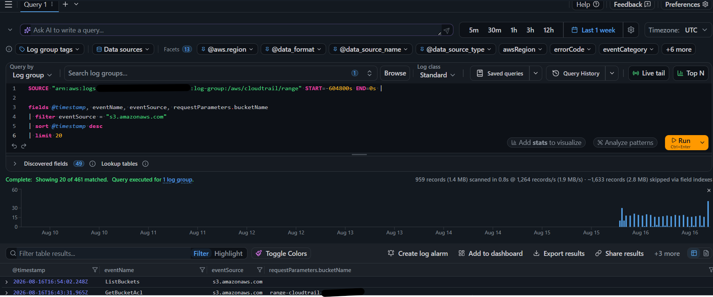
  *picture 6*

- Destroy it. Expected: 6 destroyed. Test that it's destroyed. **Expected:** no bucket listed, and
  `NoSuchEntity` on the role. Then rebuild. Expected: 6 added. This confirms the target
  environment can be repeatably built and destroyed.
- Check `/logging` to make sure the rebuild didn't disturb it.
- Run Prowler for the baseline security posture of the target.

  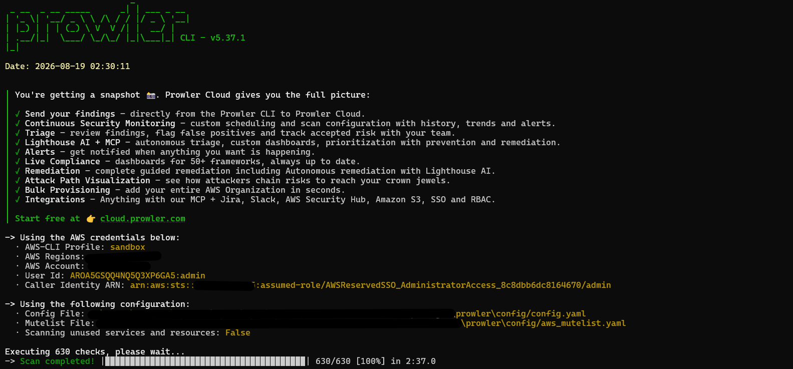
  *picture 7*

  | Metric | Baseline |
  |---|---|
  | Total FAIL | 88 |
  | **CloudWatch fails** | **17** |
  | MITRE ATT&CK PASS % | 41.67% |
  | Overall PASS % | 41.92% |

- Before the end of this week, clean the cloud first — checked, expect no output.
- Git push progress.

---

## Phase 2 — Detonate MVP five, prove SCPs

- Start the session — build terminal, attack terminal. Expected: sandbox account.
- **T1562.008 — Stop CloudTrail Trail.** Use Warmup to create a *dedicated* CloudTrail that Stratus
  owns, and confirm it.

  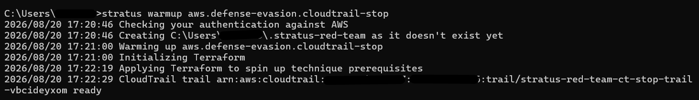
  *picture 8*

- Detonate. Record the detonation time. Confirm it reached CloudTrail — it should list the stop
  trail logging call.

  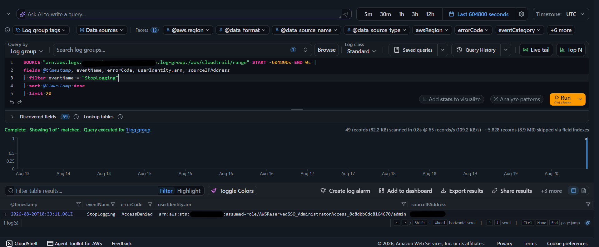
  *picture 9*

  The result: the trail-stop failed because of `AccessDenied`.

  **CloudWatch Log Analytics Results**
  **Region:** ap-southeast-7
  **Query:**
  ```
  SOURCE "arn:aws:logs:ap-southeast-7:<SANDBOX_ACCOUNT_ID>:log-group:/aws/cloudtrail/range" START=2026-08-20T09:30:00.000Z END=2026-08-20T14:50:00.000Z |
  fields @timestamp, eventName, errorCode, userIdentity.arn, sourceIPAddress
  | filter eventName = "StopLogging"
  | sort @timestamp desc
  | limit 20
  ```

  | @timestamp | eventName | errorCode | userIdentity.arn | sourceIPAddress |
  |---|---|---|---|---|
  | 2026-08-20 10:33:11.081 | StopLogging | AccessDenied | arn:aws:sts::\<SANDBOX_ACCOUNT_ID>:assumed-role/AWSReservedSSO_AdministratorAccess_8c8dbb6dc8164670/admin | <MY_IP> |

  **Raw Stratus output**
  ```
  2026/08/20 17:31:04 Checking your authentication against AWS
  2026/08/20 17:31:16 Not warming up - aws.defense-evasion.cloudtrail-stop is already warm. Use --force to force
  2026/08/20 17:31:16 Stopping CloudTrail trail stratus-red-team-ct-stop-trail-vbcideyxom
  2026/08/20 17:31:17 Error while detonating attack technique aws.defense-evasion.cloudtrail-stop: unable to stop CloudTrail logging: operation error CloudTrail: StopLogging, https response error StatusCode: 400, RequestID: 6890f494-299d-48af-b7f6-141730f4db23, api error AccessDeniedException: User: arn:aws:sts::<SANDBOX_ACCOUNT_ID>:assumed-role/AWSReservedSSO_AdministratorAccess_8c8dbb6dc8164670/admin is not authorized to perform: cloudtrail:StopLogging on resource: arn:aws:cloudtrail:ap-southeast-7:<SANDBOX_ACCOUNT_ID>:trail/stratus-red-team-ct-stop-trail-vbcideyxom with an explicit deny in a service control policy: arn:aws:organizations::<MANAGEMENT_ACCOUNT_ID>:policy/<ORG_ID>/service_control_policy/<POLICY_ID>
  ```

- Clean up this technique — but the landing zone's `deny-cloudtrail-tampering` SCP won't let it
  detach, so this has to happen from `management_ac`: detach the SCP from root first.

  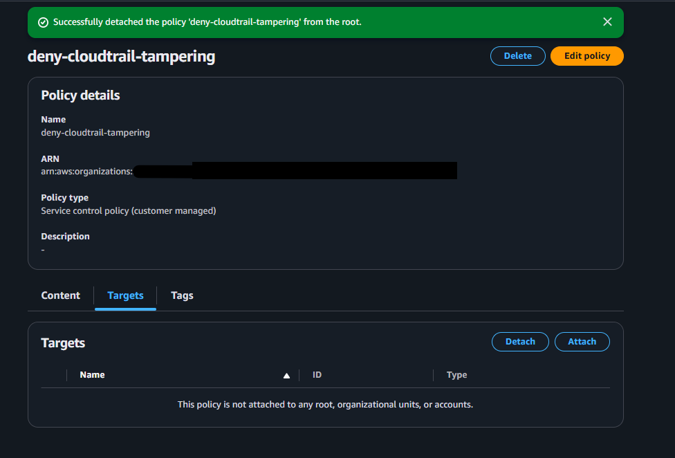
  *picture 10*

  and then reattach the SCP.

- **Now detonate the four MVP techniques.**

  | ATT&CK | Stratus ID |
  |---|---|
  | T1552.005 | `aws.credential-access.ec2-steal-instance-credentials` |
  | T1098.001 | `aws.persistence.iam-create-user-login-profile` *or* `iam-backdoor-user` |
  | T1136.003 | `aws.persistence.iam-create-admin-user` |
  | T1530 | `aws.exfiltration.ec2-share-ebs-snapshot` *or* S3-based |

  Always clean up after each technique once done.

  ### T1552.005 — `aws.credential-access.ec2-steal-instance-credentials`

  Due to my region that I use for testing, the `t3.micro` EC2 instance is not available, so I
  changed it to a region that is available.

  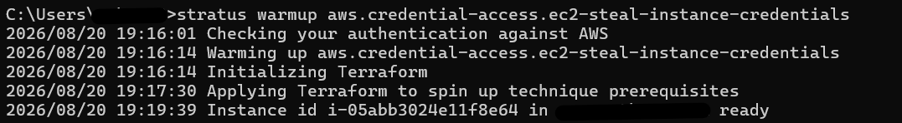
  *picture 11*

  Here is the result:

  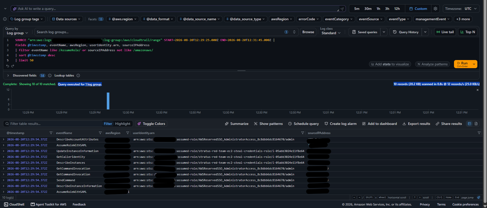
  *picture 12*

  **CloudWatch Log Analytics Results**
  **Region:** ap-southeast-7
  **Query:**
  ```
  SOURCE "arn:aws:logs:ap-southeast-7:<SANDBOX_ACCOUNT_ID>:log-group:/aws/cloudtrail/range" START=2026-08-20T12:29:25.000Z END=2026-08-20T12:31:45.000Z |
  fields @timestamp, eventName, awsRegion, userIdentity.arn, sourceIPAddress
  | filter eventName like /AssumeRole/ or sourceIPAddress not like /amazonaws/
  | sort @timestamp desc
  | limit 50
  ```

  | @timestamp | eventName | awsRegion | userIdentity.arn | sourceIPAddress |
  |---|---|---|---|---|
  | 2026-08-20 12:29:54.372 | DescribeAccountAttributes | ap-southeast-1 | arn:aws:sts::\<SANDBOX_ACCOUNT_ID>:assumed-role/AWSReservedSSO_AdministratorAccess_8c8dbb6dc8164670/admin | <MY_IP> |
  | 2026-08-20 12:29:54.372 | AssumeRoleWithSAML | ap-southeast-1 |  | 52.74.86.12 |
  | 2026-08-20 12:29:54.372 | UpdateInstanceInformation | ap-southeast-1 | arn:aws:sts::\<SANDBOX_ACCOUNT_ID>:assumed-role/stratus-red-team-ec2-steal-credentials-role/i-05abb3024e11f8e64 | 46.137.224.18 |
  | 2026-08-20 12:29:54.372 | GetCallerIdentity | ap-southeast-1 | arn:aws:sts::\<SANDBOX_ACCOUNT_ID>:assumed-role/stratus-red-team-ec2-steal-credentials-role/i-05abb3024e11f8e64 | <MY_IP> |
  | 2026-08-20 12:29:54.372 | DescribeInstances | ap-southeast-1 | arn:aws:sts::\<SANDBOX_ACCOUNT_ID>:assumed-role/stratus-red-team-ec2-steal-credentials-role/i-05abb3024e11f8e64 | <MY_IP> |
  | 2026-08-20 12:29:54.372 | GetCommandInvocation | ap-southeast-1 | arn:aws:sts::\<SANDBOX_ACCOUNT_ID>:assumed-role/AWSReservedSSO_AdministratorAccess_8c8dbb6dc8164670/admin | <MY_IP> |
  | 2026-08-20 12:29:54.372 | GetCommandInvocation | ap-southeast-1 | arn:aws:sts::\<SANDBOX_ACCOUNT_ID>:assumed-role/AWSReservedSSO_AdministratorAccess_8c8dbb6dc8164670/admin | <MY_IP> |
  | 2026-08-20 12:29:54.372 | SendCommand | ap-southeast-1 | arn:aws:sts::\<SANDBOX_ACCOUNT_ID>:assumed-role/AWSReservedSSO_AdministratorAccess_8c8dbb6dc8164670/admin | <MY_IP> |
  | 2026-08-20 12:29:54.372 | DescribeInstanceInformation | ap-southeast-1 | arn:aws:sts::\<SANDBOX_ACCOUNT_ID>:assumed-role/AWSReservedSSO_AdministratorAccess_8c8dbb6dc8164670/admin | <MY_IP> |
  | 2026-08-20 12:29:54.372 | AssumeRoleWithSAML | ap-southeast-1 |  | 52.74.86.12 |

  **Raw Stratus output**
  ```
  2026/08/20 19:27:50 Checking your authentication against AWS
  2026/08/20 19:28:03 Note: This is a slow attack technique, it might take a long time to warm up or detonate
  2026/08/20 19:28:03 Not warming up - aws.credential-access.ec2-steal-instance-credentials is already warm. Use --force to force
  2026/08/20 19:28:03 Waiting for instance i-05abb3024e11f8e64 to show up in AWS SSM
  2026/08/20 19:28:05 Running command through SSM on i-05abb3024e11f8e64: curl 169.254.169.254/latest/meta-data/iam/security-credentials/stratus-red-team-ec2-steal-credentials-role/
  2026/08/20 19:28:10 Successfully stole temporary instance credentials from the instance metadata service
  2026/08/20 19:28:10 sts:GetCallerIdentity returned arn:aws:sts::<SANDBOX_ACCOUNT_ID>:assumed-role/stratus-red-team-ec2-steal-credentials-role/i-05abb3024e11f8e64
  2026/08/20 19:28:10 Locally running a benign API call ec2:DescribeInstances using stolen credentials
  ```

  ### T1136.003 — `aws.persistence.iam-create-admin-user`

  Here is the result:

  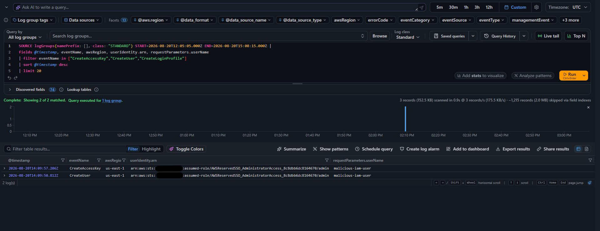
  *picture 13*

  **CloudWatch Log Analytics Results**
  **Region:** ap-southeast-7
  **Query:**
  ```
  SOURCE logGroups(namePrefix: [], class: "STANDARD") START=2026-08-20T12:05:05.000Z END=2026-08-20T15:08:15.000Z |
  fields @timestamp, eventName, awsRegion, userIdentity.arn, requestParameters.userName
  | filter eventName in ["CreateAccessKey","CreateUser","CreateLoginProfile"]
  | sort @timestamp desc
  | limit 20
  ```

  | @timestamp | eventName | awsRegion | userIdentity.arn | requestParameters.userName |
  |---|---|---|---|---|
  | 2026-08-20 14:09:57.206 | CreateAccessKey | us-east-1 | arn:aws:sts::\<SANDBOX_ACCOUNT_ID>:assumed-role/AWSReservedSSO_AdministratorAccess_8c8dbb6dc8164670/admin | malicious-iam-user |
  | 2026-08-20 14:09:50.812 | CreateUser | us-east-1 | arn:aws:sts::\<SANDBOX_ACCOUNT_ID>:assumed-role/AWSReservedSSO_AdministratorAccess_8c8dbb6dc8164670/admin | malicious-iam-user |

  **Raw Stratus output**
  ```
  2026/08/20 21:07:27 Checking your authentication against AWS
  2026/08/20 21:07:40 Creating a malicious IAM user
  2026/08/20 21:07:42 Attaching an administrative IAM policy to the malicious IAM user
  2026/08/20 21:07:42 Creating an access key for the IAM user
  2026/08/20 21:07:42 Created access key <REDACTED_KEY>
  ```

  ### T1098.001 — `aws.persistence.iam-create-user-login-profile` *or* `iam-backdoor-user`

  Used `aws.persistence.iam-backdoor-user`. Here is the result:

  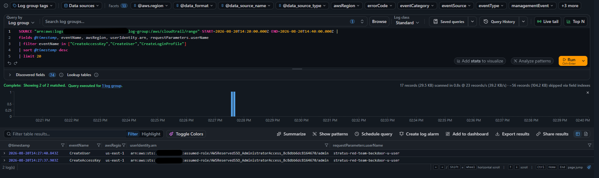
  *picture 14*

  **CloudWatch Log Analytics Results**
  **Region:** ap-southeast-7
  **Query:**
  ```
  SOURCE "arn:aws:logs:ap-southeast-7:<SANDBOX_ACCOUNT_ID>:log-group:/aws/cloudtrail/range" START=2026-08-20T14:20:00.000Z END=2026-08-20T14:40:00.000Z |
  fields @timestamp, eventName, awsRegion, userIdentity.arn, requestParameters.userName
  | filter eventName in ["CreateAccessKey","CreateUser","CreateLoginProfile"]
  | sort @timestamp desc
  | limit 20
  ```

  | @timestamp | eventName | awsRegion | userIdentity.arn | requestParameters.userName |
  |---|---|---|---|---|
  | 2026-08-20 14:27:40.843 | CreateUser | us-east-1 | arn:aws:sts::\<SANDBOX_ACCOUNT_ID>:assumed-role/AWSReservedSSO_AdministratorAccess_8c8dbb6dc8164670/admin | stratus-red-team-backdoor-u-user |
  | 2026-08-20 14:27:37.903 | CreateAccessKey | us-east-1 | arn:aws:sts::\<SANDBOX_ACCOUNT_ID>:assumed-role/AWSReservedSSO_AdministratorAccess_8c8dbb6dc8164670/admin | stratus-red-team-backdoor-u-user |

  **Raw Stratus output**
  ```
  2026/08/20 21:26:53 Checking your authentication against AWS
  2026/08/20 21:27:08 Not warming up - aws.persistence.iam-backdoor-user is already warm. Use --force to force
  2026/08/20 21:27:08 Creating access key on legit IAM user to simulate backdoor
  2026/08/20 21:27:09 Successfully created access key <REDACTED_KEY>
  ```

  ### T1530 — `aws.exfiltration.ec2-share-ebs-snapshot` *or* S3-based

  Used `aws.exfiltration.ec2-share-ebs-snapshot`. Here is the result:

  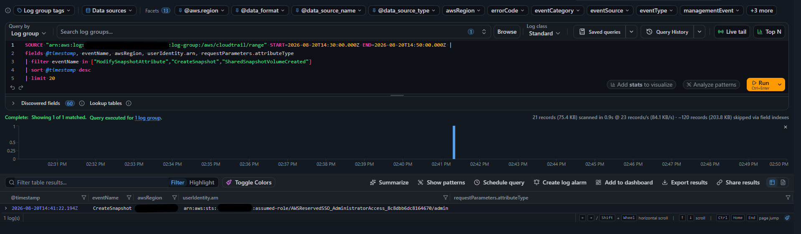
  *picture 15*

  **CloudWatch Log Analytics Results**
  **Region:** ap-southeast-7
  **Query:**
  ```
  SOURCE "arn:aws:logs:ap-southeast-7:<SANDBOX_ACCOUNT_ID>:log-group:/aws/cloudtrail/range" START=2026-08-20T14:30:00.000Z END=2026-08-20T14:50:00.000Z |
  fields @timestamp, eventName, awsRegion, userIdentity.arn, requestParameters.attributeType
  | filter eventName in ["ModifySnapshotAttribute","CreateSnapshot","SharedSnapshotVolumeCreated"]
  | sort @timestamp desc
  | limit 20
  ```

  | @timestamp | eventName | awsRegion | userIdentity.arn | requestParameters.attributeType |
  |---|---|---|---|---|
  | 2026-08-20 14:41:22.194 | CreateSnapshot | ap-southeast-7 | arn:aws:sts::\<SANDBOX_ACCOUNT_ID>:assumed-role/AWSReservedSSO_AdministratorAccess_8c8dbb6dc8164670/admin |  |

  **Raw Stratus output**
  ```
  2026/08/20 21:42:07 Checking your authentication against AWS
  2026/08/20 21:42:25 Not warming up - aws.exfiltration.ec2-share-ebs-snapshot is already warm. Use --force to force
  2026/08/20 21:42:25 Sharing the volume snapshot snap-05a70a81ced39e78d with an external AWS account...
  ```

- **Testing detection rules against a clean time window (no attack activity).** I attacked at
  10:33, 12:29, 14:09, 14:27, and 14:41 UTC on 2026-08-20, so I picked 11:00–12:00 UTC of the same
  day to check whether my detection rules had any false positives.

  **T1552.005 — instance credentials**

  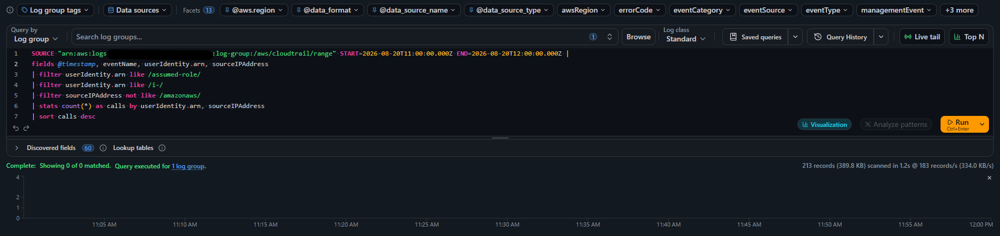
  *picture 16*

  No false positive appeared.

  **T1562.008 — stop CloudTrail**

  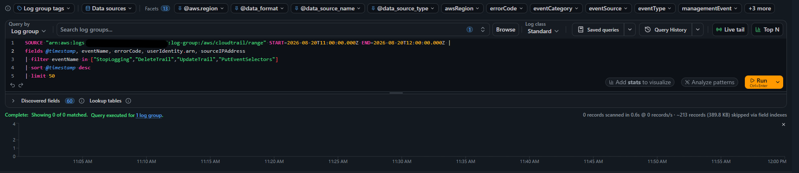
  *picture 17*

  No false positive appeared.

  **T1098.001 — backdoor user**

  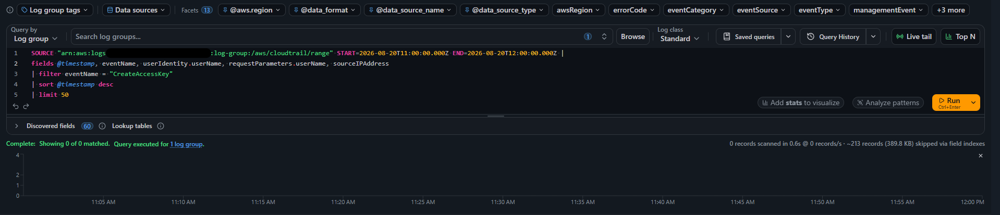
  *picture 18*

  **T1136.003 — create admin user**

  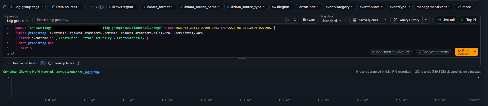
  *picture 19*

  **T1530 — share EBS snapshot**

  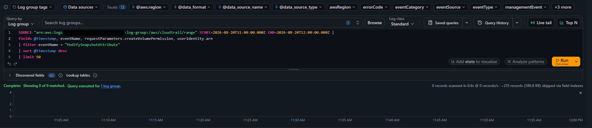
  *picture 20*

- Now, from the CloudWatch queries, build detection rules: **T1562.008 — Stop CloudTrail** and
  **T1552.005 — Instance credential theft** are added to `terraform/logging/main.tf`.
- Apply the change. **Expected:** 4 to add.

  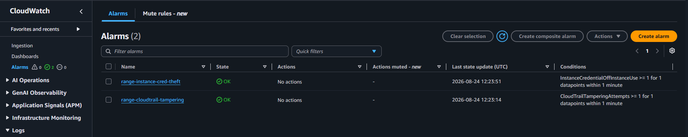
  *picture 21*

- Now test the alarm. Record the detonation time and get the MTTD — 12:51:35.

  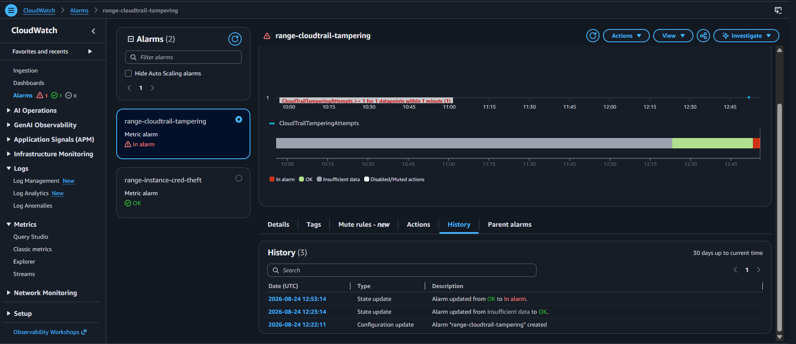
  *picture 22*

- From the landing zone — the base infrastructure of this project — capture the attack denial of
  each SCP.

  **`region-restriction` denial captured**

  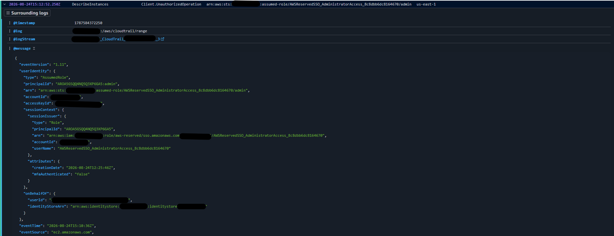
  *picture 23*

  **`deny-s3-public-access`**

  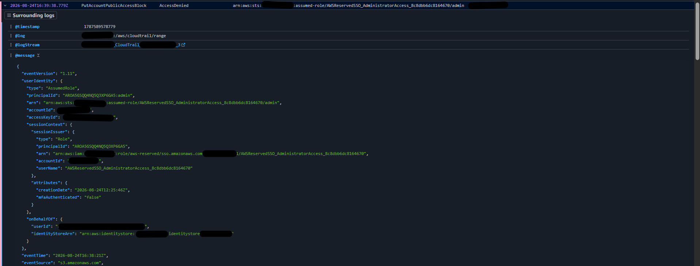
  *picture 24*

  **`deny-leave-organization`**

  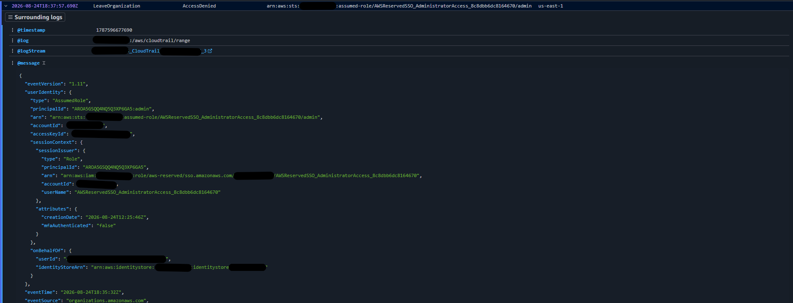
  *picture 25*

  **`deny-root-user`** — this one can't easily be tested from an assumed role, so it is "enforced
  by policy, not directly testable without root credentials."

- Compare GuardDuty findings against the CloudWatch alarm detection rules. Security account →
  GuardDuty → Findings; a CLI call lists the findings and pulls detail for each one.

  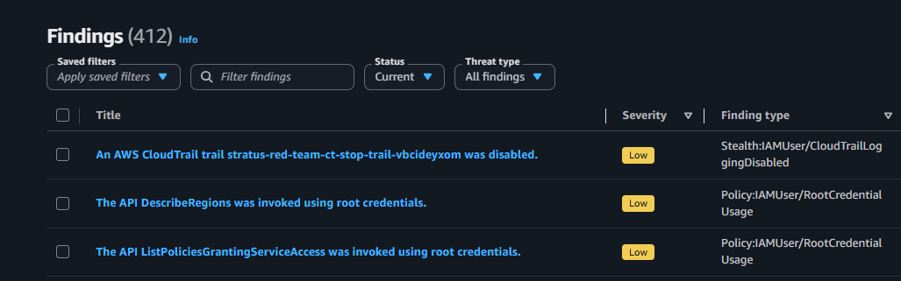
  *picture 26*

  **Comparison Table**

  | Technique | GuardDuty caught? | GuardDuty finding | Severity | Detection Rule |
  |---|---|---|---|---|
  | T1562.008 stop CloudTrail | Yes | Stealth:IAMUser/CloudTrailLoggingDisabled | Low | Yes |
  | T1552.005 instance creds | No | — | — | Yes |
  | T1136.003 create admin user | No | — | — | Yes |
  | T1098.001 backdoor user | No | — | — | Yes |
  | T1530 share EBS snapshot | No | — | — | Yes |

  **Summarize**

  | Technique | Prevented (SCP) | Detection rule | GuardDuty | My MTTD |
  |---|---|---|---|---|
  | T1562.008 stop CloudTrail | ✅ blocked | ✅ alarm | ✅ Low | 5 minutes |
  | T1552.005 instance creds | ❌ | ✅ alarm | ❌ | 5 minutes |
  | T1136.003 create admin | ❌ | ✅ hunt | ❌ | — |
  | T1098.001 backdoor user | ❌ | ✅ hunt | ❌ | — |
  | T1530 snapshot share | partial | ✅ hunt | ❌ | — |

  > **Note on MTTD:** this table records 5 minutes for both alarms, from the initial alarm test in
  > this session. The final **Speed** table later in this document (and `docs/results.md`) reports
  > ~3–4 minutes, measured on later runs. Both figures are genuine measurements taken at different
  > points in testing — CloudTrail delivery latency varies run to run. See the footnote in
  > `docs/results.md` for detail; this is flagged rather than silently resolved to one number.

- Clean up / commit progress to git.

---

## Phase 3 — More detonation, responders, MTTR, publish

- Start the session.
- Today's detonation list:
  - T1580 `aws.discovery.ec2-enumerate-from-instance`
  - T1548 `aws.privilege-escalation.iam-update-user-login-profile`

  Record detonation time, confirm the event landed (query below) for each.

  > **Correction (technique ID):** the second item above is labeled **T1548** in this session's
  > notes. T1548 is "Abuse Elevation Control Mechanism" in MITRE ATT&CK, which does not fit a
  > console-password-change action. The correct mapping — used throughout this repo — is
  > **T1098.001 (Additional Cloud Credentials)**, the same sub-technique as the backdoor-access-key
  > detonation above, via a different procedure (a console password instead of an access key). See
  > `detections/T1098.001-update-login-profile.md`. The heading below is kept as "T1098.001" with
  > the original Stratus ID for clarity; the session notes' own "T1548" label is preserved above
  > verbatim so the correction is visible.

  ### T1580 — `aws.discovery.ec2-enumerate-from-instance`

  Here is the result:

  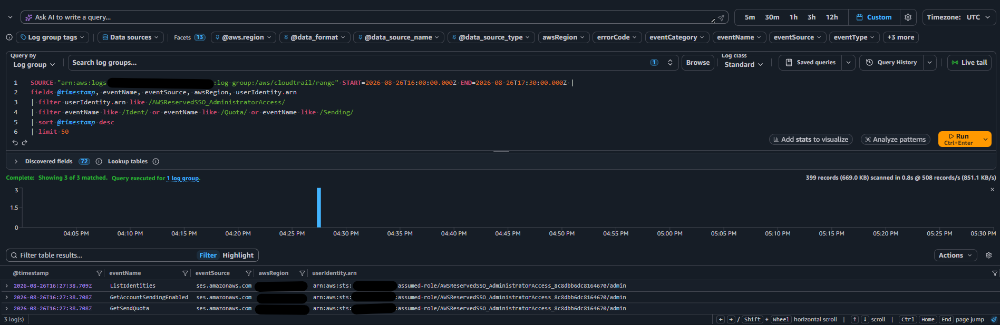

  **CloudWatch Log Analytics Results**
  **Region:** ap-southeast-7
  **Query:**
  ```
  SOURCE "arn:aws:logs:ap-southeast-7:<SANDBOX_ACCOUNT_ID>:log-group:/aws/cloudtrail/range" START=2026-08-26T16:00:00.000Z END=2026-08-26T17:30:00.000Z |
  fields @timestamp, eventName, eventSource, awsRegion, userIdentity.arn
  | filter userIdentity.arn like /AWSReservedSSO_AdministratorAccess/
  | filter eventName like /Ident/ or eventName like /Quota/ or eventName like /Sending/
  | sort @timestamp desc
  | limit 50
  ```

  | @timestamp | eventName | eventSource | awsRegion | userIdentity.arn |
  |---|---|---|---|---|
  | 2026-08-26 16:27:38.709 | ListIdentities | ses.amazonaws.com | ap-southeast-1 | arn:aws:sts::\<SANDBOX_ACCOUNT_ID>:assumed-role/AWSReservedSSO_AdministratorAccess_8c8dbb6dc8164670/admin |
  | 2026-08-26 16:27:38.708 | GetAccountSendingEnabled | ses.amazonaws.com | ap-southeast-1 | arn:aws:sts::\<SANDBOX_ACCOUNT_ID>:assumed-role/AWSReservedSSO_AdministratorAccess_8c8dbb6dc8164670/admin |
  | 2026-08-26 16:27:38.708 | GetSendQuota | ses.amazonaws.com | ap-southeast-1 | arn:aws:sts::\<SANDBOX_ACCOUNT_ID>:assumed-role/AWSReservedSSO_AdministratorAccess_8c8dbb6dc8164670/admin |

  > **Note (flagged, not corrected):** the detonation list above labels this technique with the
  > Stratus ID `aws.discovery.ec2-enumerate-from-instance`, but the query and evidence here are
  > unambiguously **SES enumeration** (`ListIdentities`, `GetAccountSendingEnabled`,
  > `GetSendQuota` against `ses.amazonaws.com`), matching the `aws.discovery.ses-enumerate` Stratus
  > module and `detections/T1580-ses-enumerate.md`. This is a naming mismatch in the session notes,
  > not in the underlying evidence — the T1580 mapping (Cloud Infrastructure Discovery) is correct
  > either way. Per scope, this is being flagged transparently rather than silently rewritten, since
  > it isn't one of the two corrections explicitly called out for this pass.

  ### T1098.001 (session notes: T1548) — `aws.privilege-escalation.iam-update-user-login-profile`

  Here is the result:

  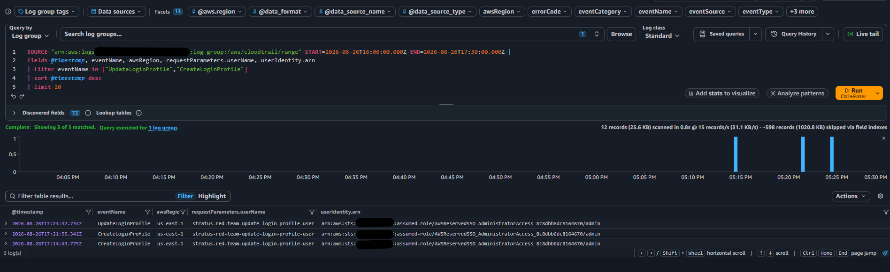

  **CloudWatch Log Analytics Results**
  **Region:** ap-southeast-7
  **Query:**
  ```
  SOURCE "arn:aws:logs:ap-southeast-7:<SANDBOX_ACCOUNT_ID>:log-group:/aws/cloudtrail/range" START=2026-08-26T16:00:00.000Z END=2026-08-26T17:30:00.000Z |
  fields @timestamp, eventName, awsRegion, requestParameters.userName, userIdentity.arn
  | filter eventName in ["UpdateLoginProfile","CreateLoginProfile"]
  | sort @timestamp desc
  | limit 20
  ```

  | @timestamp | eventName | awsRegion | requestParameters.userName | userIdentity.arn |
  |---|---|---|---|---|
  | 2026-08-26 17:24:47.734 | UpdateLoginProfile | us-east-1 | stratus-red-team-update-login-profile-user | arn:aws:sts::\<SANDBOX_ACCOUNT_ID>:assumed-role/AWSReservedSSO_AdministratorAccess_8c8dbb6dc8164670/admin |
  | 2026-08-26 17:21:55.342 | CreateLoginProfile | us-east-1 | stratus-red-team-update-login-profile-user | arn:aws:sts::\<SANDBOX_ACCOUNT_ID>:assumed-role/AWSReservedSSO_AdministratorAccess_8c8dbb6dc8164670/admin |
  | 2026-08-26 17:14:43.775 | CreateLoginProfile | us-east-1 | stratus-red-team-update-login-profile-user | arn:aws:sts::\<SANDBOX_ACCOUNT_ID>:assumed-role/AWSReservedSSO_AdministratorAccess_8c8dbb6dc8164670/admin |

- Now making detection rules for these two techniques.

  **T1580 — SES enumeration.** The signal: `GetAccountSendingEnabled`, `GetSendQuota`,
  `ListIdentities` in quick succession.

  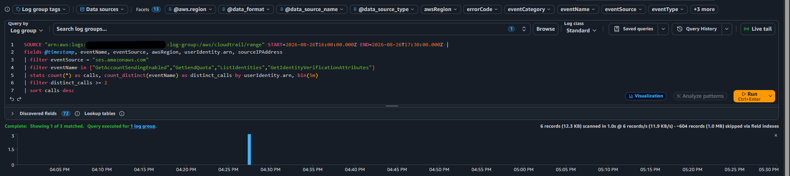

  Detects the technique with no false positive.

  **T1098.001 — password-change escalation.** The signal: `UpdateLoginProfile` on a user other
  than the caller.

  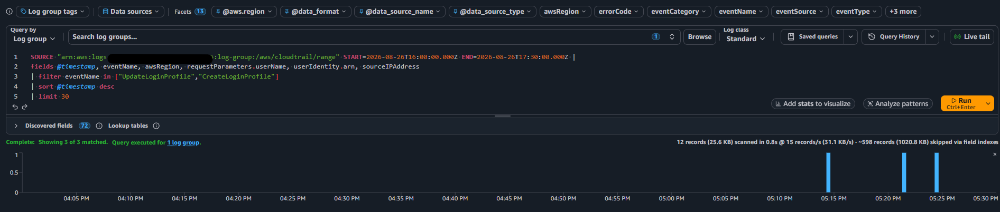

- Next, wire the alarm detection rules to a responder. The flow:

  ```
  Attack → CloudTrail → metric filter → alarm → EventBridge → Lambda → containment
  Metric alarm → SNS → Lambda
  GuardDuty finding → EventBridge → Lambda
  ```

- Add to `terraform/logging/main.tf` — also add the EventBridge path for GuardDuty to the two
  existing alarm blocks.
- Build the Lambda function for containment:

  | Responder | Triggered by | Action |
  |---|---|---|
  | Deactivate rogue key | Backdoor-user finding / access-key creation | `UpdateAccessKey` → Inactive |
  | Contain instance-cred theft | Instance-cred alarm | Attach deny-all policy to the role session |
  | Detach admin | Admin-user creation | `DetachUserPolicy` on AdministratorAccess |

  Written in `terraform/logging/lambda/responder.py` (inspects what triggered it and acts), wired
  to Terraform in `terraform/logging/responders.tf`. For `aws.persistence.iam-backdoor-user`, a
  CloudWatch alarm for unauthorized key creation and its remediation live in
  `terraform/logging/detections.tf`. Apply it.

- Test the response/containment procedure. Measure the **manual** baseline first.
  - Detonate the backdoor-user technique.
  - Try to find, investigate, and deactivate the key by hand.
  - **Notice:** query the log group for the backdoor signature.

    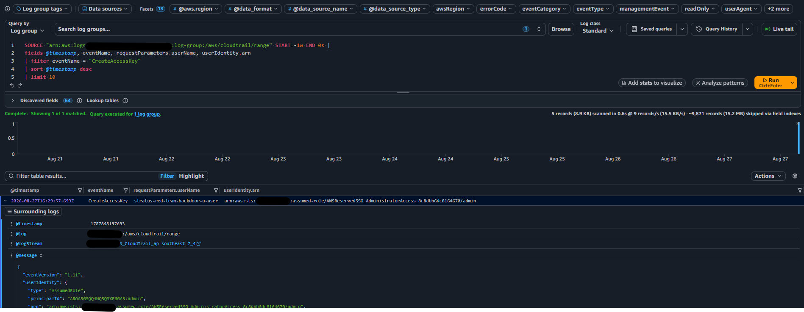

  - **Investigate:** confirm the user and see what was done with it.
  - **Contain:** disable the key.
  - **Verify:** confirm containment.
  - Manual MTTR measured: about 6 minutes.

    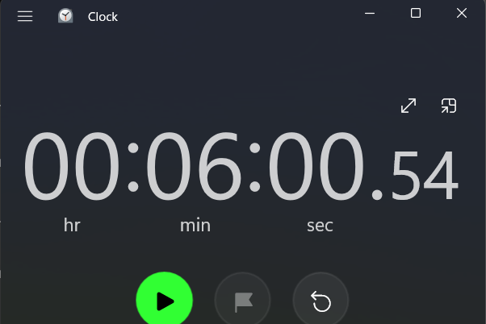

- Now the automated remediation. Measured remediation time: about 3 minutes.

  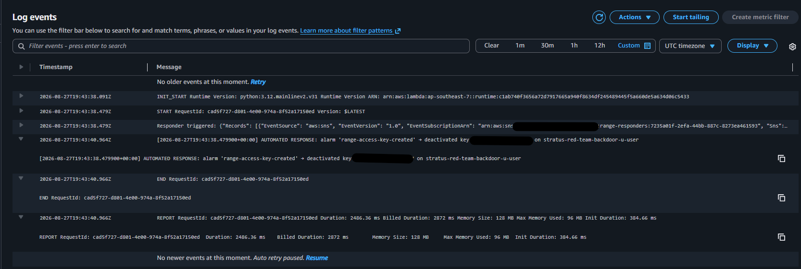

  Started at 19:40:00.

  **Summarize ⇒ Manual MTTR: 6 minutes, Automated MTTR: 3 minutes.**

- Finally, the baseline Prowler scan vs. now:

  | Metric | Baseline | After |
  |---|---|---|
  | Total checks | 630 | 630 |
  | PASS | 70 (41.9%) | 103 (46.8%) |
  | FAIL | 88 | 108 |
  | MITRE ATT&CK PASS | 41.67% | 45.45% |

  PASS count rose 70→103, MITRE ATT&CK rose 41.7%→45.5%. The raw FAIL count going up looks bad at
  first, but it is expected: I added a Lambda, an SNS topic, a second CloudTrail, and more S3
  buckets to build the detection and response layer, and Prowler scans every one of those. Most of
  the new fails are hardening gaps on that new infrastructure. The MITRE ATT&CK framework, which
  the whole project is organized around, improved from 41.67% to 45.45%.

---

## Results

### Attack results

| Technique | Prevented (SCP) | Detected | Detection type | GuardDuty |
|---|---|---|---|---|
| T1562.008 Stop CloudTrail | Blocked | Yes | Metric-filter alarm | Caught (Low) |
| T1552.005 Steal instance creds | — | Yes | Metric-filter alarm | Missed |
| T1098.001 Backdoor user | — | Yes | Metric-filter alarm | Missed |
| T1136.003 Create admin user | — | Yes | Hunt query | Missed |
| T1530 Share EBS snapshot | Partial | Yes | Hunt query | Missed |
| T1580 SES enumeration | — | Yes | Hunt query | Missed |
| T1548 Change user password *(T1098.001 — see correction above)* | — | Yes | Hunt query | Missed |

### SCP prevention

| SCP | Technique it blocks | Result | Evidence |
|---|---|---|---|
| `deny-cloudtrail-tampering` | T1562.008 | Blocked | `StopLogging` AccessDenied |
| `deny-guardduty-tampering` | Disable detection | Blocked | `UpdateDetector` AccessDenied |
| `region-restriction` | T1580 out-of-region | Blocked | `DescribeInstances` UnauthorizedOperation |
| `deny-s3-public-access` | T1530 exposure | Blocked | `PutAccountPublicAccessBlock` AccessDenied |
| `deny-leave-organization` | Org escape | Blocked | `LeaveOrganization` AccessDenied |
| `deny-root-user` | Root abuse | Enforced | Not directly testable without root |

### Speed

| Metric | Value | Notes |
|---|---|---|
| MTTD | ~3–4 min | Alarm fires after event; mostly CloudTrail delivery latency |
| MTTR (manual) | ~6 min | Human notices hunt-query signal, investigates, deactivates key |
| MTTR (automated) | ~3 min | Detonate → alarm → SNS → Lambda deactivates key, no human |
| Lambda action itself | ~ms | The containment call once triggered |

*See the MTTD note under the Phase 2 Summarize table above: an earlier alarm test measured 5
minutes for the same two techniques; this table reflects later runs. Both are real measurements —
the discrepancy is CloudTrail delivery-latency variance, not an error, and is intentionally left
visible rather than resolved to a single number.*

### Posture change (Prowler)

| Metric | Baseline | After |
|---|---|---|
| PASS | 70 (41.9%) | 103 (46.8%) |
| MITRE ATT&CK PASS | 41.67% | 45.45% |
